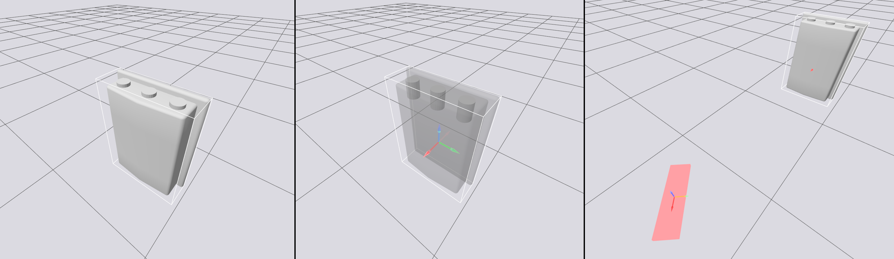

# RFID Scanner Gazebo Plugin
This Gazebo plugin simulates an RFID tag scanning system with a focus on realistic radio-frequency effects. It models antenna gain patterns, free-space path loss, and polarization mismatch to estimate received signal strength and tag readability during simulation. By accounting for relative pose, distance, and antenna orientation between readers and tags, the plugin provides a more realistic simulation of the RFID scan process, and is particularly useful in modelling retail environments (inventory monitoring, automated stock counts) and industrial environments (warehouse automation, mobile readers).

<p align="center">
    
</p>

### Features
- Service for conducting scan including custom RFID scan result messages
- Model of RFID Antenna/Reader
- Realistic RFID scanning model based on Friis free-space-path-loss (FSPL)
- Gazebo RFID Scan result proto messages and ROS2 message and service definitions

`TODO Add testing`
`TODO Add information about compatibility between gazebo versions`

## Installation

### Installation for Gazebo
First, we build the plugin.
```bash
mkdir build
cd build
cmake ..
make -j4
```

Then we can run the provided example
```bash
source setup_gz.sh
gz sim -v4 examples/world.sdf
```

In another terminal, we can call the scan service
```bash
source setup_gz.sh
gz service --timeout 10000 -s /RFIDScannerPlugin/scan_request --reqtype gz.msgs.Empty --reptype gz.custom_msgs.RFIDScanResponse -r ''
```

### Installation for ROS2
We also include ROS2 `srv`and `msg` definitions for our RFID scan messages. Because we expose our own service for requesting scans, we also need a custom ros_gz_bridge fork that is able to handle custom service bridges.

TODO Add link to forked ros_gz_bridge with support for custom service bridge

## Configuration
The SDF for this plugin has a number of parameters that can be configured.

### RFID Scanner Configuration
| Parameter | Default | Description |
| --- | --- | --- |
| `antenna_power` | 30 (dBm) | Power delivered from the RFID scanner antenna. |
| `path_loss_los_gain` | 2.2 | Gain factor applied for line-of-sight from antenna to tag. NOTE LOS is yet to be implemented so is currently assumed for all reads. |
| `path_loss_base_loss` | 31 (dB) | Path loss (in dB) when distance to tag is (theoretically) 0m. |
| `path_loss_min_distance` | 0.2 (m) | Minimum distance between reader and tag (to avoid log singularity). |
| `polarization_max_loss` | 25 (dB) | Maximum loss from polarization between reader and tag. |
| `antenna_gain_peak` | 6 (dBi) | Peak antenna gain, with 0rad relative angle. |
| `antenna_gain_max_loss` | 25 (dBi) | Max reduction in gain (from peak) from relative angle between reader boresight and tag direction. |
| `antenna_gain_loss_scaling` | 6 | Parabola scaling parameter. |
| `tag_directional_gain` | 0 (dBi) | Gain from tag due to relative angle between reader boresight and tag direction. Assumed static in this model. |
| `tx_threshold_power` | -15 (dBm) | Transmission power from reader to tag, for a 50% read chance. |
| `rx_threshold_power` | -70 (dBm) | Received power from tag to reader, for a 50% read chance. |
| `tx_read_scaling` | 2 | Sigmoid scaling parameter. |
| `rx_read_scaling` | 2 | Sigmoid scaling parameter. |

### RFID Tag Configuration
| Parameter | Default | Description |
| --- | --- | --- |
| `uid` | (required, no default) | Unique Identifier of this RFID tag. We do not ensure uniqueness amongst tags and two tags with the same UID may be repeated in scan results. |
| `data` | "" | Used to emulate stored data on the tag. Maximum size of 512 bytes. |

#### See Also
- A detailed tutorial based on this plugin, available [here]().
- Usage of this RFID plugin in an actual Gazebo simulation environment, [here](https://github.com/bulbeckh/stocktake).

