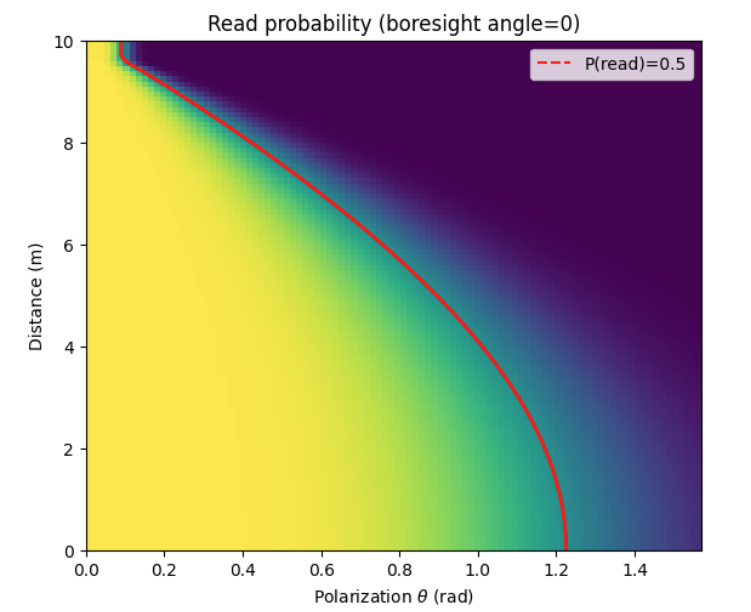

# Gazebo RFID Scanner Plugin
This Gazebo plugin simulates an RFID tag scanning system with a focus on realistic radio-frequency effects. It models antenna gain patterns, free-space path loss, and polarization mismatch to estimate received signal strength and tag readability during simulation. By accounting for relative pose, distance, and antenna orientation between readers and tags, the plugin provides a more realistic simulation of the RFID scan process, and is particularly useful in modelling retail environments (inventory monitoring, automated stock counts) and industrial environments (warehouse automation, mobile readers).

`TODO Add photos`

### Features
- Service for adding and removing tags from the simulation.
- Service for conducting scan including custom RFID scan result messages.
- OBJ Models of RFID Antenna/Reader and RFID tags.
- Realistic RFID scanning model based on Friis free-space-path-loss (FSPL).

### Installation
First, we build the plugin.
```bash
mkdir build
cd build
cmake ..
make -j4
```

Then we can run the provided example (assuming we have gazebo already installed - see [here]() for installing gazebo).
```bash
source setup_gz.sh
gz sim -v4 world.sdf
```

We should now have a running gazebo instance. In a second terminal, we can run the following bash scripts to add tags and conduct a scan.
```bash
./create.sh
./scan.sh
```

### RFID Model
The model is based on the Friis transmission equation with FSPL. 


$$P_{in} = P_{tx} + G_{r}(\mathbf{\theta_{r}}, \mathbf{x_{r}}, \mathbf{x_{t}})+G_{t} - L_{path}(\mathbf{x_{r}}, \mathbf{x_{t}}) - L_{pol}(\mathbf{\theta_{r}}, \mathbf{\theta_{r}})$$
$$P_{rx} = P_{tx} + G_{r}(\mathbf{\theta_{r}}, \mathbf{x_{r}}, \mathbf{x_{t}})+G_{t} - 2(L_{path}(\mathbf{x_{r}}, \mathbf{x_{t}}) - L_{pol}(\mathbf{\theta_{r}}, \mathbf{\theta_{r}}))$$
$$\text{RSSI}=P_{rx}+\eta_{meas}, \eta_{meas} \sim N(0, \sigma_{rssi}^{2})$$

- $P_{tx}$ is transmit power (dBm).
- $G_{r}$ and $G_{t}$ are antenna and tag gains (dBi).
- $L_{path}(d)$ and $L_{pol}$ are power loss (dB) from difference in distance and polarization between tag and antenna.

We sample from this distribution to determine if the tag is successfully read. 

$$P_{read,t}=\sigma\left(\frac{P_{in}-P_{in,\text{ offset}}}{k_{in}}\right)$$
$$P_{read,r}=\sigma\left(\frac{P_{rx}-P_{rx,\text{ offset}}}{k_{rx}}\right)$$

$$P_{read}=P_{read,t}\cdot P_{read,r}$$

<p align="center">
    
</p>

More information on the RFID model is available [here]().

### Configuration
The SDF for this plugin has a number of parameters that can be configured.

| Parameter | Default | Description |
| --- | --- | --- |
| `antenna_power` | 30 (dBm) | Power delivered from the RFID scanner antenna. |
| `path_loss_los_gain` | 2.2 | Gain factor applied for line-of-sight from antenna to tag. NOTE LOS is yet to be implemented so is currently assumed for all reads. |
| `path_loss_base_loss` | 31 (dB) | Path loss (in dB) when distance to tag is (theoretically) 0m. |
| `path_loss_min_distance` | 0.2 (m) | Minimum distance between reader and tag (to avoid log singularity). |
| `polarization_max_loss` | 25 (dB) | Maximum loss from polarization between reader and tag. |
| `antenna_gain_peak` | 6 (dBi) | Peak antenna gain, with 0rad relative angle. |
| `antenna_gain_max_loss` | 25 (dBi) | Max reduction in gain (from peak) from relative angle between reader boresight and tag direction. |
| `antenna_gain_loss_scaling` | 6 | Parabola scaling parameter. |
| `tag_directional_gain` | 0 (dBi) | Gain from tag due to relative angle between reader boresight and tag direction. Assumed static in this model. |
| `tx_threshold_power` | -15 (dBm) | Transmission power from reader to tag, for a 50% read chance. |
| `rx_threshold_power` | -70 (dBm) | Received power from tag to reader, for a 50% read chance. |
| `tx_read_scaling` | 2 | Sigmoid scaling parameter. |
| `rx_read_scaling` | 2 | Sigmoid scaling parameter. |

#### See Also
- A detailed tutorial based on this plugin, available [here]().
- Usage of this RFID plugin in an actual Gazebo simulation environment, [here]().

