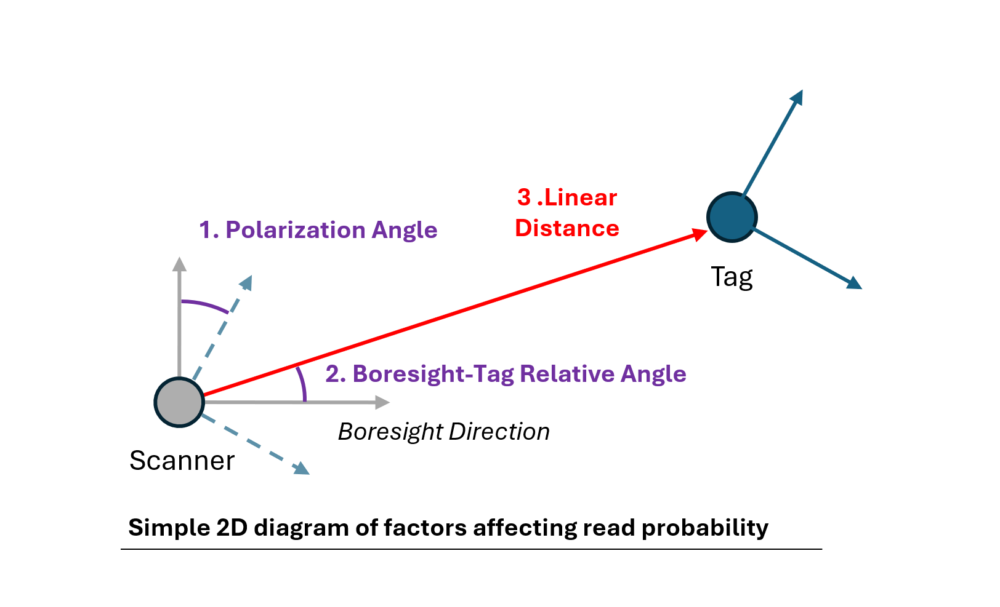
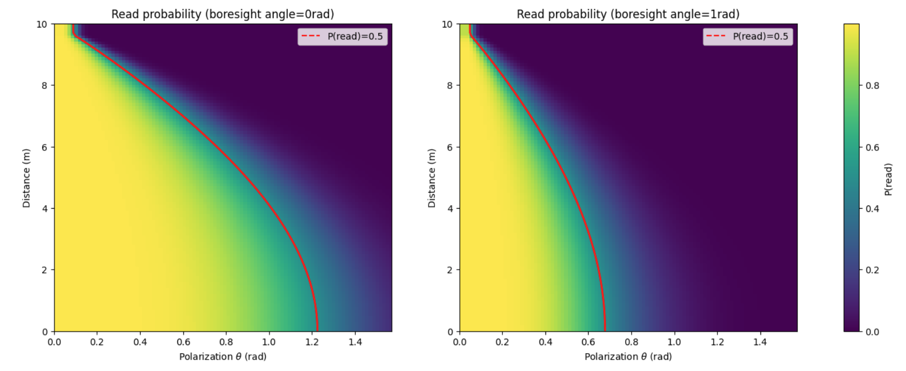

### RFID Model
There are three main factors that affect read probability in our model. Linear distance between tag and reader, the relative polarisation angle between the tag orientation and the scanner orientation and the relative angle between the antenna boresight and the vector from antenna to tag.

    

The model is based on the Friis transmission equation with FSPL. 

$$P_{in} = P_{tx} + G_{r}(\mathbf{\theta_{r}}, \mathbf{x_{r}}, \mathbf{x_{t}})+G_{t} - L_{path}(\mathbf{x_{r}}, \mathbf{x_{t}}) - L_{pol}(\mathbf{\theta_{r}}, \mathbf{\theta_{r}})$$
$$P_{rx} = P_{tx} + G_{r}(\mathbf{\theta_{r}}, \mathbf{x_{r}}, \mathbf{x_{t}})+G_{t} - 2(L_{path}(\mathbf{x_{r}}, \mathbf{x_{t}}) - L_{pol}(\mathbf{\theta_{r}}, \mathbf{\theta_{r}}))$$
$$\text{RSSI}=P_{rx}+\eta_{meas}, \eta_{meas} \sim N(0, \sigma_{rssi}^{2})$$

- $P_{tx}$ is transmit power (dBm).
- $G_{r}$ and $G_{t}$ are antenna and tag gains (dBi).
- $L_{path}(d)$ and $L_{pol}$ are power loss (dB) from difference in distance and polarization between tag and antenna.

We sample from this distribution to determine if the tag is successfully read. 

$$P_{read,t}=\sigma\left(\frac{P_{in}-P_{in,\text{ offset}}}{k_{in}}\right)$$
$$P_{read,r}=\sigma\left(\frac{P_{rx}-P_{rx,\text{ offset}}}{k_{rx}}\right)$$

$$P_{read}=P_{read,t}\cdot P_{read,r}$$

    

More information on the RFID model is available [here]().
